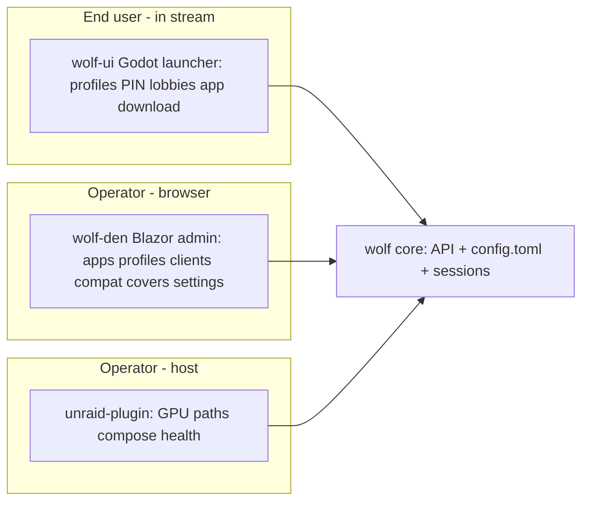

# Games on Whales — ecosystem development skeleton

**Purpose:** Single hub for research findings + draft-PR intent across the whole Games on Whales web. Sanity-check everything on **your forks** before any upstream PR (no spam).

**Plugin scope:** Host paths, compose, presets, health, ops on Unraid only. **ES-DE client state / repair is NOT plugin scope** (see §3.3).

**Fork-first workflow**

1. Branch `draft/<track>-<id>-short-name` on **your fork**, off the **correct upstream base branch** (see repo map).
2. Self-review / test on NAS or local compose.
3. Promote one PR at a time, only when ready.

**Fork remotes (wired 2026-05-29, gh user `Dadud`)** — each local clone has `origin` = upstream, `fork` = your fork:

| Repo | `fork` remote | Base branch |
|------|---------------|-------------|
| unraid-plugin | https://github.com/Dadud/unraid-plugin.git | `main` |
| wolf-den | https://github.com/Dadud/wolf-den.git | **`dev-improvements`** |
| wolf | https://github.com/Dadud/wolf.git | `stable` |
| gow | https://github.com/Dadud/gow.git | `master` |

> wolf-den local WIP was reset to `dev-improvements` per owner request; prior WIP recoverable at `refs/backup/den-wip-*`.

---

## 0. Ecosystem map (the whole pack)

The org is **much** larger than "plugin + Wolf + Den". Knowing who owns what prevents duplicate/competing work.

| Repo | Role | Lang | Activity | Our involvement |
|------|------|------|----------|-----------------|
| **wolf** | Core streaming server + Unix-socket API + `config.toml` | C++ | active (2026-05) | API/docs PRs (W track) |
| **wolf-ui** | **In-stream end-user launcher** (profiles, PINs, lobbies, app download) — the "fun" surface | C# / **Godot** | active (2026-05) | **Research-only** (§5) |
| **wolf-den** | **Web admin UI** (apps, profiles, clients, compat tools, covers) — **CANONICAL admin UI** | C# / Blazor | active on `dev-improvements` | Settings overhaul (D track) |
| **wolfmanager** | Older "web interface for managing Wolf" | — | **STALE (2025-12)** | **Ignore** — not canonical (§1.5) |
| **gow** | Dockerized apps/games + `wolf.config.toml` presets | Docker/Shell | active | Preset docs/CI (G track) |
| **GamesOnWhales.Wolf.Net.Bindings** | C# OpenAPI client over Wolf socket | C# | active | Track version; coordinate (W3/D7) |
| **inputtino** | Virtual input (mouse/kbd/pad/trackpad) | C++ | active | Upstream-tracked (controller bugs) |
| **gst-wayland-display** | Micro Wayland compositor as GStreamer plugin | Rust/C | active | Upstream-tracked (compositor) |
| **fenrir** | Control many Wolf instances in K8s | — | active | Out of scope (note only) |
| **unraid-plugin** | **This repo** — Unraid host installer | PHP/Shell | active | Primary (P track) |
| **truenas-app** | TrueNAS host installer (parallel to plugin) | — | new (2026-05) | Cross-pollinate docs (§4.5) |
| **ansible-role-run-gow** | Ansible host install | — | old (2023) | Reference only |
| **unraid-module-builder** | Build kernel modules for any Unraid version | — | old (2021) | Reference for GPU drivers (§4.5) |
| **LXC2Docker** | Docker APIs over LXC | — | active | Out of scope |
| **games-on-whales.github.io** | Docs portal | — | active | Doc PRs land here |
| **twitch-plays-wolf / discowolf** | Community bots | — | low | Out of scope |

**Three UI surfaces — do not conflate:**



- **wolf-ui** = what the player sees on their TV/Moonlight client. Lobbies + app catalog + PIN profiles.
- **wolf-den** = browser admin for the operator. Canonical admin UI.
- **unraid-plugin** = host-level install/config on Unraid.

---

## 1. wolf-den (`WolfLeash/`) — base branch `dev-improvements`

> **Correction:** Active dev is on **`dev-improvements`**, not `stable`. Base all Den branches there and watch for collisions.

### 1.1 Current state (verified)

- **Settings** (`Pages/Settings.razor`): still `Coming Soon` (~50 B) on **both** `stable` and `dev-improvements` → overhaul still unclaimed.
- **`dev-improvements` already added** (do **not** duplicate):
  - `Components/Classes/DefaultAppLoader.cs` — fetches `gow/master/apps/{name}/assets/wolf.config.toml`, parses with **Tomlyn**, builds `App`. Covers: es-de, firefox, heroic, kodi, lutris, pegasus, prismlauncher, retroarch, steam, xfce.
  - "Add wildlife apps to a newly created profile" (default-apps feature, ex-[PR #13](https://github.com/games-on-whales/wolf-den/pull/13)).
  - "Added Moonlight user Apps."
  - **Bindings bumped** (stable pins `0.0.2-alpha`; latest tag `v0.1.1-alpha`).
  - `EventLogger.cs`, `ColorGenerator.cs`, client-settings-saved notification.
- **Tomlyn is now available** → read-only TOML features are cheap.
- **Profile update** still `remove + add` (no in-place API) — [wolf-den#6](https://github.com/games-on-whales/wolf-den/issues/6).
- **App form gaps:** no UI for GStreamer pipelines / HDR / resolution; docker runner only.
- **Orphan UI:** `Components/Misc/DiskUsage.razor` (not routed on stable).

### 1.2 `DefaultAppLoader` fragility (bug to fix)

Reads `runner["devices"|"env"|"mounts"|"ports"]` as **required** keys:

```csharp
Devices = ((TomlArray)runner["devices"]).Select(...).ToList(),
Ports   = ((TomlArray)runner["ports"]).Select(...).ToList(),
```

A gow preset missing any key throws. Also hardcodes `Support_hdr=false`, empty gst pipelines. → defensive parsing PR + feeds **G3** (preset CI).

### 1.3 Draft PRs (rebased on `dev-improvements`)

| ID | Branch | Title | Scope | Status |
|----|--------|-------|-------|--------|
| D1–D5 | `draft/den-settings-overhaul` | Settings (combined) | Tabbed read-only Settings (connection, Den-local, sessions, server TOML, disk) | [draft PR #2](https://github.com/Dadud/wolf-den/pull/2) |
| ~~D6~~ | — | ~~Import gow presets~~ | **DONE upstream** (`DefaultAppLoader`) — instead: harden parsing + add plex/emby/youtube | [merge] |
| D7 | `draft/den-profile-update` | Use W1 in-place update | Blocked on wolf **W1**; bindings already bumped | [ ] |
| D8 | `draft/den-test-route-gate` | Gate `/test` to Development | — | [ ] |
| D9 | `draft/den-defaultapp-harden` | Harden `DefaultAppLoader` | Defensive TOML keys, optional HDR/pipeline passthrough | [draft PR #1](https://github.com/Dadud/wolf-den/pull/1) |

### 1.4 Settings overhaul IA

1. Connection & health  2. Libraries & mounts (read-only audit; link to Apps editor)  3. Sessions (+ preview after W2)  4. Shortcuts → Compat Tools, Covers  5. Advanced — `WOLF_*` reference + read-only TOML.

**Do not** duplicate plugin host-path pickers or wolf-ui's end-user launching.

### 1.5 wolfmanager decision

**Treat wolf-den as canonical.** `wolfmanager` is stale (last push 2025-12, ~6 mo). Do **not** split PRs across both. Note in any Den PR description that Den is the maintained admin UI.

### 1.6 Issues to link

[den#5](https://github.com/games-on-whales/wolf-den/issues/5) idle CPU · [den#6](https://github.com/games-on-whales/wolf-den/issues/6) profile order · [den#8](https://github.com/games-on-whales/wolf-den/issues/8) view stream · [den#14](https://github.com/games-on-whales/wolf-den/issues/14) Sway/Gamescope toggle · [den#15](https://github.com/games-on-whales/wolf-den/issues/15) bundle scripts.

---

## 2. wolf (core server) — base branch `stable`

### 2.1 Current state (verified)

- **Config:** TOML v7 (`serialised_config.hpp`); default `config.v7.toml` seeds gow apps into profile `user`.
- **Socket API:** HTTP over Unix socket (`api/unix_socket_server.cpp`). Default `$XDG_RUNTIME_DIR/wolf.sock`; plugin uses `/tmp/sockets/wolf.sock` (shared `wolf-socket` volume).
- **Missing:** `POST /api/v1/profiles/update`; stream peek/snapshot; global-config read/write API.
- **Hackability is file/env only:** encoders, HDR, resolution, multi-GPU `render_node` live in `config.toml` / env — no API, no UI (§4.4).
- **Release model:** rolling `:stable` / `:edge` images; last semver release **2024.07**. No pinning story (§4.6).
- **Quickstart** [PR #382](https://github.com/games-on-whales/wolf/pull/382) (incl. `unraid.sh`) closed unmerged — reference only; plugin is the Unraid path.

### 2.2 Draft PRs (fork)

| ID | Branch | Title | Scope | Status |
|----|--------|-------|-------|--------|
| W1 | `draft/wolf-profiles-update` | `POST /api/v1/profiles/update` | In-place profile edit; stable ordering | [draft](https://github.com/Dadud/wolf/pull/2) |
| W2 | `draft/wolf-session-peek` | Session preview API | Read-only stream snapshot/metadata | [draft](https://github.com/Dadud/wolf/pull/4) |
| W3 | `draft/wolf-openapi-bindings` | OpenAPI publish + bindings coordination | Tie to bindings `v0.1.x` | [ ] |
| W4 | `draft/wolf-socket-docs` | Document socket path variants | runtime dir vs `/var/run/wolf` vs plugin volume | [draft](https://github.com/Dadud/wolf/pull/1) |
| W5 | `draft/wolf-config-get` | Global config read (GET) | hostname, codec flags, render_node — unblocks Den D4 edit + configurability | [draft](https://github.com/Dadud/wolf/pull/3) |
| W6 | `draft/wolf-quickstart-doc` | quickstart vs Unraid plugin doc | No plugin duplication | [ ] |

**Tracking:** [wolf#356](https://github.com/games-on-whales/wolf/issues/356) (open, profile update + stream peek).

### 2.3 Stability bugs (ecosystem context, mostly upstream-owned)

- Steam crash/kick: [#344](https://github.com/games-on-whales/wolf/issues/344), [#360](https://github.com/games-on-whales/wolf/issues/360) (+ gow [PR #282](https://github.com/games-on-whales/gow/pull/282)).
- Wolf crash on lobby join: [#364](https://github.com/games-on-whales/wolf/issues/364) (affects multi-user "fun").
- Bindings broke on API change: [#357](https://github.com/games-on-whales/wolf/issues/357) → motivates W3 + pinning.
- NVIDIA manual start error: [#345](https://github.com/games-on-whales/wolf/issues/345).

---

## 3. gow (apps & presets) — base branch `master`

### 3.1 Current state (verified)

- Apps: emby, es-de, firefox, heroic-games-launcher, kodi, lutris, pegasus, plex, prismlauncher, retroarch, steam, xfce, youtube.
- Preset `apps/*/assets/wolf.config.toml` uses `[[apps]]` + `[apps.runner]`; almost all `mounts = []`.
- Wolf auto-mounts `/home/retro`, Pulse, Wayland (`sessions/common.cpp`).
- `RUN_SWAY` inconsistent (`1` vs `true`).
- `bin/build-toml.sh` → `website/public/apps.toml` aggregate.

### 3.2 Draft PRs (fork)

| ID | Branch | Title | Scope | Status |
|----|--------|-------|-------|--------|
| G1 | `draft/gow-preset-mount-examples` | Commented mount examples | es-de, retroarch | [draft](https://github.com/Dadud/gow/pull/1) |
| G2 | `draft/gow-run-sway-normalize` | Normalize RUN_SWAY | all presets | [draft](https://github.com/Dadud/gow/pull/2) |
| G3 | `draft/gow-preset-ci` | Preset schema CI | deserialize vs Wolf `BaseApp`; also protects Den `DefaultAppLoader` | [draft](https://github.com/Dadud/gow/pull/3) |
| G4 | `draft/gow-preset-example` | `wolf.config.example.toml` | placeholder host paths | [ ] |
| G5 | `draft/gow-preset-pipeline` | Single-source export | gow → wolf default slice + Den catalog | [ ] |
| G6 | `draft/gow-library-mounts` | Container startup resilience | es-de/retroarch/pegasus/steam/lutris library paths + warnings | [draft] |

### 3.3 ES-DE / emulator UX (gow + den, NOT plugin)

| Topic | Owner | Notes |
|-------|-------|-------|
| `ROMDirectory` in `es_settings.xml` | gow image first-run | Per-client state |
| `es_systems.xml` custom scripts | gow `es-de` | First launch populates |
| Empty ES-DE despite `/ROMs` | den Apps mounts + gow docs | User binds `/etc/wolf/roms` wrongly |
| ROM layout `ROMs/<System>/` | gow docs / ES-DE | Not a plugin validator concern |

**Plugin `repair-esde.sh`:** out of plugin finalize scope; gow G6 normalizes `ROMDirectory` on startup instead.

---

## 3.5 unraid-plugin (P track) — base branch `main`

Fork PRs stack on `draft/plugin-rom-grabgo` → `draft/plugin-finalize`.

| ID | Branch / PR | Scope | Status |
|----|-------------|-------|--------|
| P1–P3 | `draft/plugin-rom-grabgo` [#1](https://github.com/Dadud/unraid-plugin/pull/1) | ROM wiring card, checklist, path validator | [draft] |
| P4–P9 | `draft/plugin-finalize` [#2](https://github.com/Dadud/unraid-plugin/pull/2) | Apps summary, preset fuzzy-match, digest pinning, ES-DE repair removal, docs | [draft] |
| P10 | `draft/plugin-finalize` (same stack) | Unified library mounts: per-app audit UI, library chown on deploy, fix-all session refresh, `library-audit.sh` | [draft] |

Local Unraid dev: `unraid-dev/prepare.ps1` + `serve.ps1` → `plugin install http://<dev-ip>:8888/gow-dev.plg`; day-2 updates via `dev-sync.sh`.

---

## 4. Cross-cutting

### 4.1 Socket path matrix

| Deployment | Wolf creates | Den connects | Notes |
|------------|--------------|--------------|-------|
| Upstream README | `/var/run/wolf/wolf.sock` | mount + `WOLF_SOCKET_PATH` | socat in entrypoint |
| Unraid plugin | `/tmp/sockets/wolf.sock` | `wolf-socket` volume | doc in W4 + plugin P7 |

### 4.2 Library mount contract (two layers)

**Layer 1 — Wolf service (compose only):** `gow.cfg` paths → `/etc/wolf/{roms,steam,games,lutris,bioses,media}` inside the **Wolf** container.

**Layer 2 — App sessions (Moonlight apps):** `apply-mount-presets.py` writes host binds into each `[[profiles.apps]]` runner in `config.toml`.

```text
gow.cfg → library-links symlink → compose (Layer 1) → apply-mount-presets (Layer 2) → session container paths
                                                                                    ↘ ES-DE XML (client state) ← gow G6
```

| App | `gow.cfg` key | Session container path | Plugin preset | gow startup (G6) |
|-----|---------------|------------------------|---------------|------------------|
| EmulationStation | ROMS, BIOS, MEDIA | `/ROMs`, `/bioses`, `/media` | Yes | Normalize `ROMDirectory`; `~/ROMs` symlink |
| RetroArch | ROMS | `/ROMs` | Yes | Empty `/ROMs` warning |
| Pegasus | ROMS, BIOS | `/ROMs`, `/bioses` | Yes | `~/ROMs` symlink |
| Steam | STEAM | `/home/retro/.local/share/Steam` | Yes | `~/.steam/steam` symlink; writable check |
| Lutris | LUTRIS | `/var/lutris` | Yes (replaces `lutris:` volume) | Writable check |
| Prismlauncher / Heroic / xfce | GAMES | `/games` | Yes | — |
| Kodi | MEDIA | `/media` | Yes | — |

Diagnostics: `bash /boot/config/plugins/gow/scripts/library-audit.sh`

### 4.3 Preset title brittleness

Plugin `apply-mount-presets.py` uses fuzzy title matching and aliases (ES-DE → EmulationStation). Dashboard **Libraries in apps** card shows per-app mount status. Den Settings mount audit still deferred.

### 4.4 Configurability gap (biggest "config" hole)

Encoders / HDR / resolution / multi-GPU `render_node` are hardcoded-empty in `AppForm` **and** `DefaultAppLoader`, and absent from every UI. Wolf's headline feature ("edit pipelines, multi-GPU encode-on-iGPU/game-on-dGPU") is unconfigurable except by hand-editing TOML.

**Roadmap:** W5 (config API) → Den editor (post-W5) → optional plugin surfacing of `render_node`. Until then: read-only display + honest "edit `config.toml`" docs.

### 4.5 Cross-platform host installers

`unraid-plugin`, `truenas-app`, `ansible-role-run-gow` solve the same problem (compose + socket + GPU + boot persistence). `unraid-module-builder` overlaps the plugin's NVIDIA driver volume build. **Action:** keep a shared "host deployment contract" doc (socket path, env, GPU, autostart) so the installers stay consistent. Do not merge them; cross-link.

### 4.6 Version-skew / compatibility (stability)

Rolling `:stable`/`:edge` tags + alpha bindings = real drift risk (already bit: wolf #357).

| Item | Status |
|------|--------|
| Plugin digest pinning in `gow.cfg` + `.image-digests` record | Done (P4–P9) |
| Dashboard digest display | Done |
| “Update available” vs blind pull | Not started |
| Den: surface wolf image + bindings version | Partial (Settings connection tab) |
| Compatibility matrix (wolf ↔ Den ↔ plugin) | See §8 smoke matrix |

### 4.7 Bindings

stable Den pins `0.0.2-alpha`; latest tag `v0.1.1-alpha`; `dev-improvements` bumped. Any wolf API change → bindings release (W3) → Den bump (D7) in lockstep.

---

## 5. wolf-ui (research-only — no PRs yet)

The in-stream **end-user** launcher; **Godot/C#** (`src/`, `config.toml`, `Skerga.GodotNodeUtilGenerator`). Default branch `main`, active.

**Why it matters for "remote gaming fun":** lobbies (co-op same instance), PIN-gated profiles, in-stream app download (pulls images from registry), return-to-launcher hotkey. This is the experience layer; admin UIs (Den) and host (plugin) only set it up.

**Research questions (fill in before any PR):**
- How does wolf-ui talk to Wolf — same socket API or Godot-native? Shared bindings?
- Where do lobbies live in the API (`/api/v1/lobbies/*`) and how does wolf-ui drive them?
- Theming / branding hooks for an Unraid-flavored build?
- Overlap with Den's app catalog (DefaultAppLoader) — single source of truth?

**Deferred PR ideas (do not start):** WU1 controller/lobby polish, WU2 app-catalog parity with Den, WU3 theming. Revisit after plugin + Den + W-track land.

---

## 8. Test matrix and definition of done

Run on Unraid after `dev-sync.sh` (or fresh `plugin install`) → **Fix mounts** → **relaunch from Moonlight**.

| App | Pass criteria |
|-----|---------------|
| ES-DE | `grep '/ROMs'` under EmulationStation in `config.toml`; `docker inspect WolfES-DE*` shows host→`/ROMs`; ≥1 system with games |
| Steam | Steam runner mounts `…/.local/share/Steam`; install or library-add writes under host `steamapps/` |
| Lutris | Host path → `/var/lutris` (not `lutris:` volume); Lutris opens |
| RetroArch / Pegasus | `/ROMs` mount present; content smoke |
| Prismlauncher / Heroic | `/games` mount if `GAMES_LIBRARY` set |

**Fresh install paths**

| Audience | Command |
|----------|---------|
| Dev (Windows PC) | `cd unraid-dev; .\prepare.ps1; .\serve.ps1` |
| Dev (Unraid, first time) | `plugin install http://<dev-ip>:8888/gow-dev.plg` |
| Dev (Unraid, after edits) | `bash …/dev-sync.sh http://<dev-ip>:8888` |
| Production | `plugin install https://github.com/games-on-whales/unraid-plugin/releases/latest/download/gow.plg` |

---

## 9. Promotion order (fork → upstream)

1. **P10 + G6** — library mount fix validated on Dudserver (§8).
2. Merge **P stack** to fork `main`; cut plugin release tag.
3. **G1–G3** upstream (low risk).
4. **Den #1 + #2** upstream (Settings + DefaultAppLoader).
5. **W4** docs upstream.
6. Defer **W1/W2/W5** until wolf CI green on fork.
7. Defer G4/G5, W3, D7/D8, §4.5 host contract, wolf-ui §5.

---

## 10. Upstream promotion checklist

- [ ] Branch on correct base (Den → `dev-improvements`, wolf → `stable`, gow → `master`).
- [ ] Rebased; no collision with in-flight work (check Den `dev-improvements` first).
- [ ] Issue links (#356, den#6, etc.).
- [ ] Test matrix (Unraid / plain Docker / GPU vendor).
- [ ] Plugin PRs independent of Den/Wolf merges.
- [ ] Bindings/API changes paired (W3 ↔ D7).

---

## 11. Changelog

| Date | Author | Change |
|------|--------|--------|
| 2026-05-30 | — | P10 unified library mounts; G6 container startup; Library Mount Contract §4.2; §8–§9 test/promotion; fork PR status refresh |
| 2026-05-29 | — | Initial skeleton from E2E audit + multi-repo plan |
| 2026-05-29 | — | Opus review: full repo map; wolf-ui (research-only) + wolfmanager (stale/ignore); Den base→dev-improvements, D6 done upstream, +D9; version-skew §4.6; configurability §4.4; cross-platform §4.5; stability bugs §2.3 |
