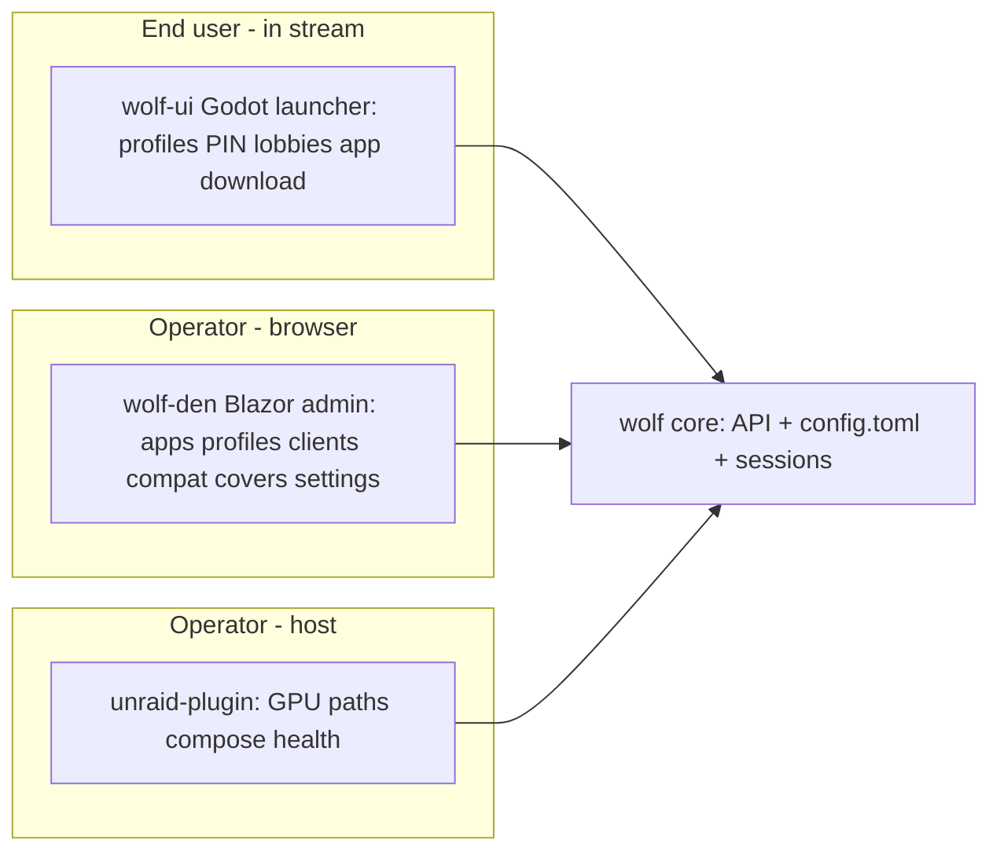

# Games on Whales — ecosystem development skeleton

**Purpose:** Single hub for research findings + draft-PR intent across the whole Games on Whales web. Sanity-check everything on **your forks** before any upstream PR (no spam).

**Plugin scope:** Host paths, compose, presets, health, ops on Unraid only. **ES-DE client state / repair is NOT plugin scope** (see §3.3).

**Fork-first workflow**

1. Branch `draft/<track>-<id>-short-name` on **your fork**, off the **correct upstream base branch** (see repo map).
2. Self-review / test on NAS or local compose.
3. Promote one PR at a time, only when ready.

**Fork remotes (wired 2026-05-29, gh user `Dadud`)** — each local clone has `origin` = upstream, `fork` = your fork:

| Repo | `fork` remote | Base branch |
|------|---------------|-------------|
| unraid-plugin | https://github.com/Dadud/unraid-plugin.git | `main` |
| wolf-den | https://github.com/Dadud/wolf-den.git | **`dev-improvements`** |
| wolf | https://github.com/Dadud/wolf.git | `stable` |
| gow | https://github.com/Dadud/gow.git | `master` |

> wolf-den local WIP was reset to `dev-improvements` per owner request; prior WIP recoverable at `refs/backup/den-wip-*`.

---

## 0. Ecosystem map (the whole pack)

The org is **much** larger than "plugin + Wolf + Den". Knowing who owns what prevents duplicate/competing work.

| Repo | Role | Lang | Activity | Our involvement |
|------|------|------|----------|-----------------|
| **wolf** | Core streaming server + Unix-socket API + `config.toml` | C++ | active (2026-05) | API/docs PRs (W track) |
| **wolf-ui** | **In-stream end-user launcher** (profiles, PINs, lobbies, app download) — the "fun" surface | C# / **Godot** | active (2026-05) | **Research-only** (§5) |
| **wolf-den** | **Web admin UI** (apps, profiles, clients, compat tools, covers) — **CANONICAL admin UI** | C# / Blazor | active on `dev-improvements` | Settings overhaul (D track) |
| **wolfmanager** | Older "web interface for managing Wolf" | — | **STALE (2025-12)** | **Ignore** — not canonical (§1.5) |
| **gow** | Dockerized apps/games + `wolf.config.toml` presets | Docker/Shell | active | Preset docs/CI (G track) |
| **GamesOnWhales.Wolf.Net.Bindings** | C# OpenAPI client over Wolf socket | C# | active | Track version; coordinate (W3/D7) |
| **inputtino** | Virtual input (mouse/kbd/pad/trackpad) | C++ | active | Upstream-tracked (controller bugs) |
| **gst-wayland-display** | Micro Wayland compositor as GStreamer plugin | Rust/C | active | Upstream-tracked (compositor) |
| **fenrir** | Control many Wolf instances in K8s | — | active | Out of scope (note only) |
| **unraid-plugin** | **This repo** — Unraid host installer | PHP/Shell | active | Primary (P track) |
| **truenas-app** | TrueNAS host installer (parallel to plugin) | — | new (2026-05) | Cross-pollinate docs (§4.5) |
| **ansible-role-run-gow** | Ansible host install | — | old (2023) | Reference only |
| **unraid-module-builder** | Build kernel modules for any Unraid version | — | old (2021) | Reference for GPU drivers (§4.5) |
| **LXC2Docker** | Docker APIs over LXC | — | active | Out of scope |
| **games-on-whales.github.io** | Docs portal | — | active | Doc PRs land here |
| **twitch-plays-wolf / discowolf** | Community bots | — | low | Out of scope |

**Three UI surfaces — do not conflate:**



- **wolf-ui** = what the player sees on their TV/Moonlight client. Lobbies + app catalog + PIN profiles.
- **wolf-den** = browser admin for the operator. Canonical admin UI.
- **unraid-plugin** = host-level install/config on Unraid.

---

## 1. wolf-den (`WolfLeash/`) — base branch `dev-improvements`

> **Correction:** Active dev is on **`dev-improvements`**, not `stable`. Base all Den branches there and watch for collisions.

### 1.1 Current state (verified)

- **Settings** (`Pages/Settings.razor`): still `Coming Soon` (~50 B) on **both** `stable` and `dev-improvements` → overhaul still unclaimed.
- **`dev-improvements` already added** (do **not** duplicate):
  - `Components/Classes/DefaultAppLoader.cs` — fetches `gow/master/apps/{name}/assets/wolf.config.toml`, parses with **Tomlyn**, builds `App`. Covers: es-de, firefox, heroic, kodi, lutris, pegasus, prismlauncher, retroarch, steam, xfce.
  - "Add wildlife apps to a newly created profile" (default-apps feature, ex-[PR #13](https://github.com/games-on-whales/wolf-den/pull/13)).
  - "Added Moonlight user Apps."
  - **Bindings bumped** (stable pins `0.0.2-alpha`; latest tag `v0.1.1-alpha`).
  - `EventLogger.cs`, `ColorGenerator.cs`, client-settings-saved notification.
- **Tomlyn is now available** → read-only TOML features are cheap.
- **Profile update** still `remove + add` (no in-place API) — [wolf-den#6](https://github.com/games-on-whales/wolf-den/issues/6).
- **App form gaps:** no UI for GStreamer pipelines / HDR / resolution; docker runner only.
- **Orphan UI:** `Components/Misc/DiskUsage.razor` (not routed on stable).

### 1.2 `DefaultAppLoader` fragility (bug to fix)

Reads `runner["devices"|"env"|"mounts"|"ports"]` as **required** keys:

```csharp
Devices = ((TomlArray)runner["devices"]).Select(...).ToList(),
Ports   = ((TomlArray)runner["ports"]).Select(...).ToList(),
```

A gow preset missing any key throws. Also hardcodes `Support_hdr=false`, empty gst pipelines. → defensive parsing PR + feeds **G3** (preset CI).

### 1.3 Draft PRs (rebased on `dev-improvements`)

| ID | Branch | Title | Scope | Status |
|----|--------|-------|-------|--------|
| D1–D5 | `draft/den-settings-overhaul` | Settings overhaul (one cohesive PR) | Connection&health, Den-local config, active sessions (`GetSessionsAsync`), server read-only (Tomlyn), Overview wires `DiskUsage` | ✅ [fork PR #2](https://github.com/Dadud/wolf-den/pull/2) (builds) |
| ~~D6~~ | — | ~~Import gow presets~~ | **DONE upstream** (`DefaultAppLoader`) — folded into D9 | [merge] |
| D7 | `draft/den-profile-update` | Use W1 in-place update | Blocked on wolf **W1** ([fork PR #2](https://github.com/Dadud/wolf/pull/2)); bindings regen needed first | [ ] |
| D8 | `draft/den-test-route-gate` | Gate `/test` to Development | — | [ ] |
| D9 | `draft/den-defaultapp-harden` | Harden `DefaultAppLoader` | Defensive TOML keys; +plex/emby/youtube; HDR/pipeline passthrough | ✅ [fork PR #1](https://github.com/Dadud/wolf-den/pull/1) (builds) |

> **Settings shipped as one read-only overhaul PR** (not 5 micro-PRs) since it is a from-scratch page. Sessions table keys on app/client/IP because **`StreamSession` exposes no stable session id** in bindings 0.1.0-alpha → see §4.8 (blocks #8 view-stream). Compat-tools options type lives on `compatibilitytools-fixes`, so D2 reads a config key or shows "not configured".

### 1.4 Settings overhaul IA

1. Connection & health  2. Libraries & mounts (read-only audit; link to Apps editor)  3. Sessions (+ preview after W2)  4. Shortcuts → Compat Tools, Covers  5. Advanced — `WOLF_*` reference + read-only TOML.

**Do not** duplicate plugin host-path pickers or wolf-ui's end-user launching.

### 1.5 wolfmanager decision

**Treat wolf-den as canonical.** `wolfmanager` is stale (last push 2025-12, ~6 mo). Do **not** split PRs across both. Note in any Den PR description that Den is the maintained admin UI.

### 1.6 Issues to link

[den#5](https://github.com/games-on-whales/wolf-den/issues/5) idle CPU · [den#6](https://github.com/games-on-whales/wolf-den/issues/6) profile order · [den#8](https://github.com/games-on-whales/wolf-den/issues/8) view stream · [den#14](https://github.com/games-on-whales/wolf-den/issues/14) Sway/Gamescope toggle · [den#15](https://github.com/games-on-whales/wolf-den/issues/15) bundle scripts.

---

## 2. wolf (core server) — base branch `stable`

### 2.1 Current state (verified)

- **Config:** TOML v7 (`serialised_config.hpp`); default `config.v7.toml` seeds gow apps into profile `user`.
- **Socket API:** HTTP over Unix socket (`api/unix_socket_server.cpp`). Default `$XDG_RUNTIME_DIR/wolf.sock`; plugin uses `/tmp/sockets/wolf.sock` (shared `wolf-socket` volume).
- **Missing:** `POST /api/v1/profiles/update`; stream peek/snapshot; global-config read/write API.
- **Hackability is file/env only:** encoders, HDR, resolution, multi-GPU `render_node` live in `config.toml` / env — no API, no UI (§4.4).
- **Release model:** rolling `:stable` / `:edge` images; last semver release **2024.07**. No pinning story (§4.6).
- **Quickstart** [PR #382](https://github.com/games-on-whales/wolf/pull/382) (incl. `unraid.sh`) closed unmerged — reference only; plugin is the Unraid path.

### 2.2 Draft PRs (fork)

| ID | Branch | Title | Scope | Status |
|----|--------|-------|-------|--------|
| W1 | `draft/wolf-profiles-update` | `POST /api/v1/profiles/update` | In-place, order-preserving; mirrors Add/RemoveProfile | ✅ [fork PR #2](https://github.com/Dadud/wolf/pull/2) ⚠️ not compiled |
| W2 | `draft/wolf-session-peek` | `GET /api/v1/sessions/metadata` | Read-only metadata (res/fps/audio/app/streaming). Visual preview = follow-up (GStreamer); no `created_at` yet | ✅ [fork PR #4](https://github.com/Dadud/wolf/pull/4) ⚠️ not compiled |
| W3 | — (no branch) | OpenAPI + bindings | OpenAPI auto-generated from `rfl` route annotations → endpoints appear in `/api/v1/openapi-schema`; **bindings must be regenerated + version-bumped** | [bindings TODO] |
| W4 | `draft/wolf-socket-docs` | Document socket path variants | runtime dir vs `/var/run/wolf` vs plugin volume | ✅ [fork PR #1](https://github.com/Dadud/wolf/pull/1) (docs) |
| W5 | `draft/wolf-config-get` | `GET /api/v1/config` (read-only) | hostname/uuid/hevc/av1 + gst defaults from serialised TOML — unblocks Den D4 + configurability | ✅ [fork PR #3](https://github.com/Dadud/wolf/pull/3) ⚠️ not compiled |
| W6 | `draft/wolf-quickstart-doc` | quickstart vs Unraid plugin doc | No plugin duplication | [ ] |

**Tracking:** [wolf#356](https://github.com/games-on-whales/wolf/issues/356) (open, profile update + stream peek). **None of the C++ PRs were compiled here** (large GStreamer build) — CI/maintainer build required; each PR body flags the risky spots (W5 request-time TOML load + `rfl::Description` response fields; W2 `streaming` flag derived from `wayland_display`).

### 2.3 Stability bugs (ecosystem context, mostly upstream-owned)

- Steam crash/kick: [#344](https://github.com/games-on-whales/wolf/issues/344), [#360](https://github.com/games-on-whales/wolf/issues/360) (+ gow [PR #282](https://github.com/games-on-whales/gow/pull/282)).
- Wolf crash on lobby join: [#364](https://github.com/games-on-whales/wolf/issues/364) (affects multi-user "fun").
- Bindings broke on API change: [#357](https://github.com/games-on-whales/wolf/issues/357) → motivates W3 + pinning.
- NVIDIA manual start error: [#345](https://github.com/games-on-whales/wolf/issues/345).

---

## 3. gow (apps & presets) — base branch `master`

### 3.1 Current state (verified)

- Apps: emby, es-de, firefox, heroic-games-launcher, kodi, lutris, pegasus, plex, prismlauncher, retroarch, steam, xfce, youtube.
- Preset `apps/*/assets/wolf.config.toml` uses `[[apps]]` + `[apps.runner]`; almost all `mounts = []`.
- Wolf auto-mounts `/home/retro`, Pulse, Wayland (`sessions/common.cpp`).
- `RUN_SWAY` inconsistent (`1` vs `true`).
- `bin/build-toml.sh` → `website/public/apps.toml` aggregate.

### 3.2 Draft PRs (fork)

| ID | Branch | Title | Scope | Status |
|----|--------|-------|-------|--------|
| G1 | `draft/gow-preset-mount-examples` | Commented mount examples | es-de, retroarch (`mounts` stays `[]`, verified) | ✅ [fork PR #1](https://github.com/Dadud/gow/pull/1) |
| G2 | `draft/gow-run-sway-normalize` | Normalize RUN_SWAY → `true` | 5 presets fixed (emby/es-de/firefox/plex/youtube); base image uses `[ -n "$RUN_SWAY" ]`, no numeric test | ✅ [fork PR #2](https://github.com/Dadud/gow/pull/2) |
| G3 | `draft/gow-preset-ci` | Preset schema CI | `bin/validate-presets.py` (tomllib) + GH workflow on `apps/**`; protects Den `DefaultAppLoader` | ✅ [fork PR #3](https://github.com/Dadud/gow/pull/3) |
| G4 | `draft/gow-preset-example` | `wolf.config.example.toml` | placeholder host paths | [ ] |
| G5 | `draft/gow-preset-pipeline` | Single-source export | gow → wolf default slice + Den catalog | [ ] |

> **G3 validator ran clean over all 13 presets** (exit 0): every preset declares `title`, `icon_png_path`, `runner.name/image` and `devices/env/mounts/ports` as arrays. So **no real `DefaultAppLoader` key-gap exists today** — D9 hardening is defense-in-depth + future-proofing, not a current-bug fix. Failure path verified against a crafted bad preset.

### 3.3 ES-DE / emulator UX (gow + den, NOT plugin)

| Topic | Owner | Notes |
|-------|-------|-------|
| `ROMDirectory` in `es_settings.xml` | gow image first-run | Per-client state |
| `es_systems.xml` custom scripts | gow `es-de` | First launch populates |
| Empty ES-DE despite `/ROMs` | den Apps mounts + gow docs | User binds `/etc/wolf/roms` wrongly |
| ROM layout `ROMs/<System>/` | gow docs / ES-DE | Not a plugin validator concern |

**Plugin `repair-esde.sh`:** out of plugin finalize scope; repair belongs in gow startup or a future Den "library health".

---

## 4. Cross-cutting

### 4.1 Socket path matrix

| Deployment | Wolf creates | Den connects | Notes |
|------------|--------------|--------------|-------|
| Upstream README | `/var/run/wolf/wolf.sock` | mount + `WOLF_SOCKET_PATH` | socat in entrypoint |
| Unraid plugin | `/tmp/sockets/wolf.sock` | `wolf-socket` volume | doc in W4 + plugin P7 |

### 4.2 ROM wiring layers

```text
gow.cfg → library-links symlink → compose bind → apply-mount-presets → config.toml app mounts → session /ROMs
                                                                          ↘ ES-DE XML (client state) ← gow/den scope
```

Plugin automates through TOML presets only.

### 4.3 Preset title brittleness

Plugin `apply-mount-presets.py` matches exact `title`; Den renames break it silently. Surface in Den Settings "mount audit".

### 4.4 Configurability gap (biggest "config" hole)

Encoders / HDR / resolution / multi-GPU `render_node` are hardcoded-empty in `AppForm` **and** `DefaultAppLoader`, and absent from every UI. Wolf's headline feature ("edit pipelines, multi-GPU encode-on-iGPU/game-on-dGPU") is unconfigurable except by hand-editing TOML.

**Roadmap:** W5 (config API) → Den editor (post-W5) → optional plugin surfacing of `render_node`. Until then: read-only display + honest "edit `config.toml`" docs.

### 4.5 Cross-platform host installers

`unraid-plugin`, `truenas-app`, `ansible-role-run-gow` solve the same problem (compose + socket + GPU + boot persistence). `unraid-module-builder` overlaps the plugin's NVIDIA driver volume build. **Action:** keep a shared "host deployment contract" doc (socket path, env, GPU, autostart) so the installers stay consistent. Do not merge them; cross-link.

### 4.6 Version-skew / compatibility (stability)

Rolling `:stable`/`:edge` tags + alpha bindings = real drift risk (already bit: wolf #357). **Roadmap:**
- Plugin: allow pinning image digests in `gow.cfg`; record deployed digests; "update available" vs blind pull. — **DONE** in plugin PR #2 (P8): `WOLF_IMAGE`/`WOLF_DEN_IMAGE` configurable, digests recorded to `cfg/.image-digests`, surfaced in Status.
- Den: surface effective wolf image + bindings version (D1, in Den Settings overhaul).
- Maintain a small **compatibility matrix** (wolf image ↔ bindings ↔ Den ↔ plugin) — table below.

**Compatibility matrix (known-good as of 2026-05-29).** Update each row when a component is bumped; a column changing without the row re-verified = suspect.

| Component | Pin / version | Where set | Notes |
|-----------|---------------|-----------|-------|
| Wolf image | `ghcr.io/games-on-whales/wolf:stable` | plugin compose / `WOLF_IMAGE` | rolling; pin by digest for reproducibility |
| Wolf Den image | `ghcr.io/games-on-whales/wolf-den:stable` | plugin compose / `WOLF_DEN_IMAGE` | rolling; pin by digest |
| Wolf .NET bindings | `0.1.0-alpha` | `WolfLeash.csproj` (dev-improvements) | stable Den pinned `0.0.2-alpha` → drift |
| Wolf Den base branch | `dev-improvements` | this repo set | ahead of `stable` |
| Tomlyn (Den TOML) | `0.20.0` | `WolfLeash.csproj` | used by `DefaultAppLoader` + Settings server tab |
| Unraid plugin | `2026.05.31` | `gow.plg` / `vars.sh` | adds digest pinning (P8) |

**Rule of thumb:** any Wolf API change → bump bindings (W3) → bump Den `csproj` (D7) → re-verify this table → consider pinning the plugin to the new Wolf digest.

### 4.7 Bindings

stable Den pins `0.0.2-alpha`; `dev-improvements` pins `0.1.0-alpha`. Any wolf API change → bindings release (W3) → Den bump (D7) in lockstep. **New endpoints (W1/W2/W5) are auto-published to `/api/v1/openapi-schema` via `rfl` route annotations**, but the C# bindings package must be regenerated + version-bumped before Den can call them (D7 etc.).

### 4.8 Missing stable session id (cross-repo, blocks view-stream)

Confirmed from both Den and wolf work: **`StreamSession` exposes no stable session id** (only app/client/ip/resolution), and **no `created_at` timestamp**. Consequences:
- Den's new Settings "Active sessions" tab (D1–D5) and wolf's `GET /api/v1/sessions/metadata` (W2) must key on app/client/IP — fragile, can't address one session.
- Per-session actions (stop, **view-stream [den#8](https://github.com/games-on-whales/wolf-den/issues/8)**) are blocked.

**Proposed wolf follow-up (feeds W2/W3):** add `session_id` + `created_at` to `StreamSession` and surface them in the sessions endpoints; then bindings regen → Den keys the table on `session_id` and unlocks #8.

---

## 5. wolf-ui (research-only — no PRs yet)

The in-stream **end-user** launcher; **Godot/C#** (`src/`, `config.toml`, `Skerga.GodotNodeUtilGenerator`). Default branch `main`, active.

**Why it matters for "remote gaming fun":** lobbies (co-op same instance), PIN-gated profiles, in-stream app download (pulls images from registry), return-to-launcher hotkey. This is the experience layer; admin UIs (Den) and host (plugin) only set it up.

**Research questions (fill in before any PR):**
- How does wolf-ui talk to Wolf — same socket API or Godot-native? Shared bindings?
- Where do lobbies live in the API (`/api/v1/lobbies/*`) and how does wolf-ui drive them?
- Theming / branding hooks for an Unraid-flavored build?
- Overlap with Den's app catalog (DefaultAppLoader) — single source of truth?

**Deferred PR ideas (do not start):** WU1 controller/lobby polish, WU2 app-catalog parity with Den, WU3 theming. Revisit after plugin + Den + W-track land.

---

## 6. Upstream promotion checklist

- [ ] Branch on correct base (Den → `dev-improvements`, wolf → `stable`, gow → `master`).
- [ ] Rebased; no collision with in-flight work (check Den `dev-improvements` first).
- [ ] Issue links (#356, den#6, etc.).
- [ ] Test matrix (Unraid / plain Docker / GPU vendor).
- [ ] Plugin PRs independent of Den/Wolf merges.
- [ ] Bindings/API changes paired (W3 ↔ D7).

---

## 7. Changelog

| Date | Author | Change |
|------|--------|--------|
| 2026-05-29 | — | Initial skeleton from E2E audit + multi-repo plan |
| 2026-05-29 | — | Opus review: full repo map; wolf-ui (research-only) + wolfmanager (stale/ignore); Den base→dev-improvements, D6 done upstream, +D9; version-skew §4.6; configurability §4.4; cross-platform §4.5; stability bugs §2.3 |
| 2026-05-29 | impl | Fork remotes wired (gh `Dadud`); Den WIP reset to `dev-improvements` (backup ref). **Plugin PRs opened on fork:** [#1 P1-P3 ROM grab-and-go](https://github.com/Dadud/unraid-plugin/pull/1), [#2 P4-P9 apps/presets/digest-pinning/ES-DE-removal/docs](https://github.com/Dadud/unraid-plugin/pull/2). §4.6 compatibility matrix populated; P8 digest pinning DONE. |
| 2026-05-29 | impl | **All repo tracks landed as fork draft PRs.** Den: [#1 DefaultAppLoader harden](https://github.com/Dadud/wolf-den/pull/1) + [#2 Settings overhaul](https://github.com/Dadud/wolf-den/pull/2) (both build). wolf: [#1 socket docs](https://github.com/Dadud/wolf/pull/1), [#2 profiles/update](https://github.com/Dadud/wolf/pull/2), [#3 config get](https://github.com/Dadud/wolf/pull/3), [#4 session metadata](https://github.com/Dadud/wolf/pull/4) (C++ uncompiled). gow: [#1 mount examples](https://github.com/Dadud/gow/pull/1), [#2 RUN_SWAY→true](https://github.com/Dadud/gow/pull/2), [#3 preset CI](https://github.com/Dadud/gow/pull/3). New findings: §4.8 missing session id (blocks #8); G3 validator clean (D9 = defense-in-depth); W3 OpenAPI auto-gen needs bindings regen. |
